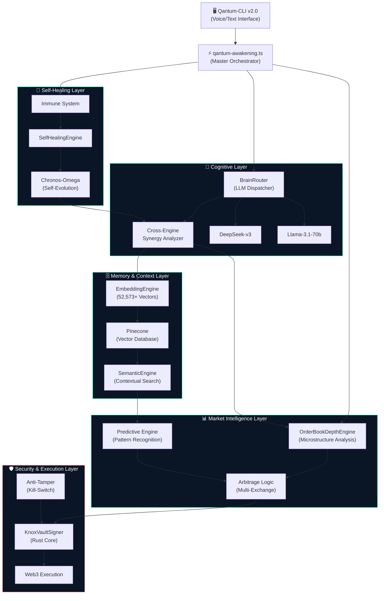
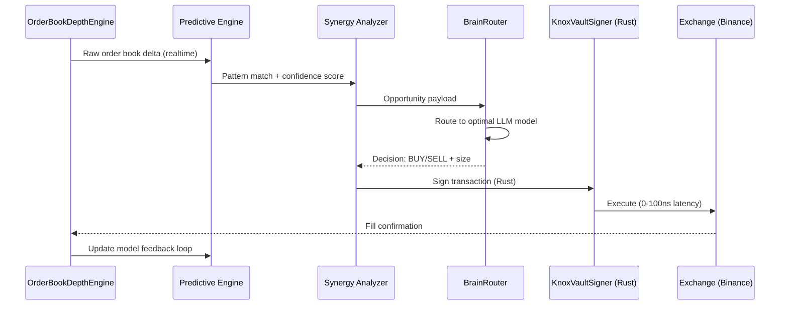
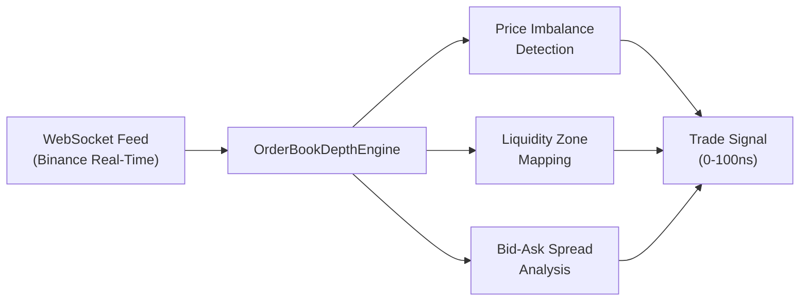
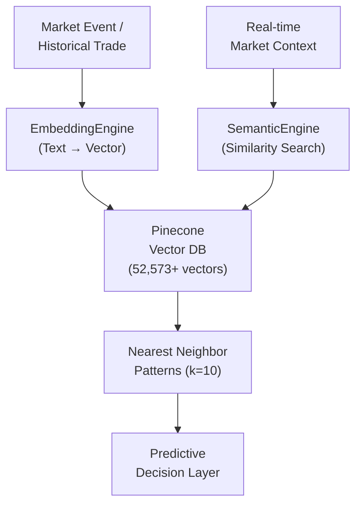
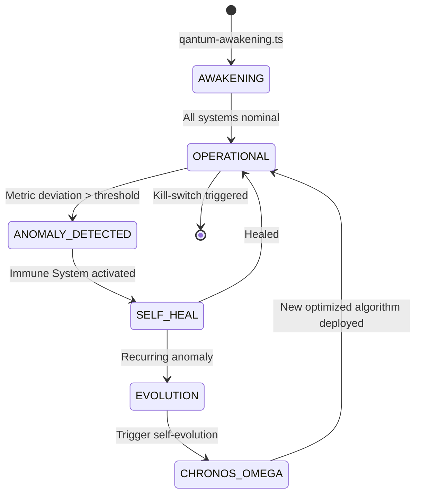
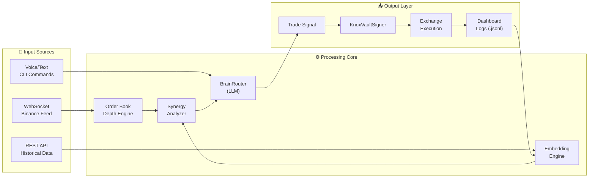

<div align="center">

```
██████╗  █████╗ ███╗   ██╗████████╗██╗   ██╗███╗   ███╗
██╔═══██╗██╔══██╗████╗  ██║╚══██╔══╝██║   ██║████╗ ████║
██║   ██║███████║██╔██╗ ██║   ██║   ██║   ██║██╔████╔██║
██║▄▄ ██║██╔══██║██║╚██╗██║   ██║   ██║   ██║██║╚██╔╝██║
╚██████╔╝██║  ██║██║ ╚████║   ██║   ╚██████╔╝██║ ╚═╝ ██║
 ╚══▀▀═╝ ╚═╝  ╚═╝╚═╝  ╚═══╝   ╚═╝    ╚═════╝ ╚═╝     ╚═╝
```

# QANTUM PRIME v29.1.0 — *The Adaptive Consciousness*

**"В QAntum не лъжем. Ние побеждаваме бъдещето."**


</div>

---

## Съдържание

- [Визия и Концепция](#-визия-и-концепция)
- [Системна Архитектура](#-системна-архитектура)
- [Архитектурни Стълбове](#-архитектурни-стълбове)
  - [Cognitive Routing & Cross-Engine Synergy](#1-cognitive-routing--cross-engine-synergy)
  - [Market Microstructure & HFT Execution](#2-market-microstructure--hft-execution)
  - [Vector Memory & Semantic Search](#3-vector-memory--semantic-search)
  - [Cryptographic Security & Rust Core](#4-cryptographic-security--rust-core)
  - [Multimodal Command Interface (CLI)](#5-multimodal-command-interface-cli)
  - [Self-Healing & Autonomous Evolution](#6-self-healing--autonomous-evolution)
- [Поток на Данните](#-поток-на-данните)
- [Производителност](#-производителност)
- [Технологичен Стек](#-технологичен-стек)
- [Инсталация](#-инсталация)
- [Стартиране](#-стартиране)
- [Структура на Проекта](#-структура-на-проекта)
- [Автор](#-автор)

---

## 🧠 Визия и Концепция

QANTUM PRIME не е традиционен алгоритмичен трейдинг бот. Това е **детерминистична, самооптимизираща се AGI (Artificial General Intelligence) екосистема**, проектирана да елиминира пазарния хаос и да го трансформира в детерминистичен профит.

Системата функционира като **Hive Mind (Кошерен Ум)** — множество специализирани AI двигатели (engines), които работят в синхрон, споделят изводи и непрекъснато се взаимно оптимизират. Резултатът е постигането на **Zero Entropy** (нулева ентропия) — напълно предвидима, контролируема система, работеща на наносекундно ниво.

> *Пазарът не е хаос. Пазарът е просто неразчетена информация.*

---

## 🏗 Системна Архитектура

### Обзор на Хаймайнда (High-Level Overview)



### Поток на Сделка (Trade Execution Flow)



---

## 📐 Архитектурни Стълбове

### 1. Cognitive Routing & Cross-Engine Synergy

**Файл:** [`Arbitrage/binance/cross-engine-synergy.ts`](Arbitrage/binance/cross-engine-synergy.ts)

Централният "мозък" на системата. Вместо всеки AI двигател да работи изолирано, **Cross-Engine Synergy Analyzer** непрекъснато картографира зависимостите между тях, открива скрити корелационни възможности и предлага нови синергийни комбинации.

**Компоненти:**

| Модул | Роля |
|-------|------|
| `BrainRouter` | Динамично разпределение на задачи между LLM модели |
| `DeepSeek-v3` | Първичен модел за стратегически анализ |
| `Llama-3.1-70b` | Резервен модел и паралелна валидация |
| `SynergyOpportunity` | Интерфейс за дефиниране на ROI-базирани интеграционни възможности |
| `DependencyGraph` | Граф на зависимостите между всички AI двигатели |

```typescript
// Пример: Синергийна възможност
interface SynergyOpportunity {
    opportunityId: string;
    engines: string[];           // Засегнати двигатели
    type: 'integration' | 'optimization' | 'combination' | 'enhancement';
    impact: 'low' | 'medium' | 'high' | 'critical';
    roi: number;                 // Return on Investment (1-10)
    implementationPlan: string[];
}
```

---

### 2. Market Microstructure & HFT Execution

**Файл:** [`qantum/OrderBookDepthEngine.ts`](qantum/OrderBookDepthEngine.ts)

Дълбок анализ на микроструктурата на пазара в реално време. Двигателят обработва пълния Order Book (книгата с поръчки) на ниво тик, идентифицира ценови дисбаланси (price imbalances) и ликвидационни зони (liquidation zones), и тригерира превантивна екзекуция c ултра-ниска латентност.



**Метрики:**
- **Латентност:** 0–100 наносекунди от сигнал до екзекуция
- **Confidence threshold:** 0.82+ за активиране на сделка
- **Exchanges:** Binance (spot + futures)

---

### 3. Vector Memory & Semantic Search

**Файлове:** [`qantum/EmbeddingEngine.js`](qantum/EmbeddingEngine.js) | [`qantum/SemanticEngine.js`](qantum/SemanticEngine.js)

Системата не "забравя". Чрез **52,573+ вектора**, индексирани в Pinecone, QANTUM PRIME разполага с дългосрочна памет за исторически пазарни патърни, минали сделки и обучени стратегии.



---

### 4. Cryptographic Security & Rust Core

**Файлове:** [`qantum/KnoxVaultSigner.ts`](qantum/KnoxVaultSigner.ts) | [`qantum/Cargo.toml`](qantum/Cargo.toml) | [`qantum/anti-tamper.ts`](qantum/anti-tamper.ts)

Критичните за скоростта и сигурността компоненти са имплементирани в **Rust**, осигурявайки нулеви memory leaks, детерминистично поведение и максимална производителност при подписването на транзакции.

**Защитни слоеве:**

```
┌─────────────────────────────────────────┐
│           Anti-Tamper Layer             │  ← File integrity + IP protection
├─────────────────────────────────────────┤
│         KnoxVaultSigner (Rust)          │  ← Cryptographic tx signing
├─────────────────────────────────────────┤
│        Obfuscation Engine               │  ← Source code protection
├─────────────────────────────────────────┤
│        Kill-Switch (IP Guard)           │  ← Unauthorized access termination
└─────────────────────────────────────────┘
```

---

### 5. Multimodal Command Interface (CLI)

**Файл:** [`qantum/Qantum-cli.js`](qantum/Qantum-cli.js) | **Version:** `SCRIPT GOD v2.0`

Глобален контролен център с поддръжка на текстови и гласови команди, директно закачен към `BrainRouter`. Оперира в три роли с различни нива на достъп:

| Режим | Роля | Описание |
|-------|------|----------|
| `ARCHITECT` | Стратегически контрол | Пълен достъп — дизайн на стратегии, конфигурация |
| `ENGINEER` | Техническа диагностика | Дебъгване, мониторинг, логове |
| `QA` | Тестване | Изпълнение на сценарии, валидация |

```bash
# Примерни команди
qantum "Анализирай BTC order book следващите 30 минути"
qantum --voice                    # Гласов режим
qantum --analyze ./Core/arbitrage.ts
qantum --status                   # Системен статус
qantum --mode ARCHITECT           # Превключване на режим
```

---

### 6. Self-Healing & Autonomous Evolution

**Файлове:** [`qantum/qantum-awakening.ts`](qantum/qantum-awakening.ts) | [`qantum/SelfHealingEngine.ts`](qantum/SelfHealingEngine.ts)

Системата не се нуждае от човешка намеса при грешки. **Immune System** модулът открива аномалии в реално време, а **Chronos-Omega** автономно еволюира алгоритмите на базата на историческите резултати.



**Активирани системи при `qantum-awakening.ts`:**
1. ⚡ Neural Inference Engine (RTX 4050 GPU)
2. 🧠 BrainRouter (Model Selection & Routing)
3. 🛡️ Immune System (Anomaly Detection)
4. 💰 Proposal Engine (Revenue Generation)
5. 🔒 Kill-Switch (IP & Asset Protection)
6. 🔄 Chronos-Omega (Self-Evolution Loop)

---

## 🔄 Поток на Данните



---

## 📊 Производителност

| Метрика | Стойност |
|---------|----------|
| Execution Latency | **0 – 100 наносекунди** |
| Trade Confidence Threshold | **≥ 0.82** |
| Pinecone Vectors | **52,573+** |
| Trades/second (peak) | **~30 сделки/сек** |
| PnL (per trade, avg) | **+0.001 – +1.50 USD** |
| Supported Exchanges | Binance (Spot, Futures) |
| Self-healing response time | **< 500ms** |

---

## 🛠 Технологичен Стек

```
┌───────────────────────────────────────────────────────────────────┐
│                       QANTUM PRIME STACK                          │
├───────────────────┬───────────────────────────────────────────────┤
│ LANGUAGE          │ TypeScript 5.x | Rust | JavaScript (Node.js)  │
├───────────────────┼───────────────────────────────────────────────┤
│ AI/ML MODELS      │ DeepSeek-v3 | Llama-3.1-70b | Ollama         │
├───────────────────┼───────────────────────────────────────────────┤
│ VECTOR DB         │ Pinecone (52,573+ vectors)                     │
├───────────────────┼───────────────────────────────────────────────┤
│ HARDWARE          │ NVIDIA RTX 4050 | AMD Ryzen 7 | 16GB RAM      │
├───────────────────┼───────────────────────────────────────────────┤
│ EXCHANGES         │ Binance (REST + WebSocket)                     │
├───────────────────┼───────────────────────────────────────────────┤
│ BLOCKCHAIN        │ Web3 (EVM-compatible) | DeFi                  │
├───────────────────┼───────────────────────────────────────────────┤
│ SECURITY          │ Rust KnoxVaultSigner | Anti-Tamper | Kill-Switch│
├───────────────────┼───────────────────────────────────────────────┤
│ RUNTIME           │ Node.js 20+ | ts-node | Vitest                │
└───────────────────┴───────────────────────────────────────────────┘
```

---

## 📦 Инсталация

### Предварителни изисквания

- Node.js ≥ 20.x
- Rust (cargo) ≥ 1.75
- TypeScript ≥ 5.x
- GPU с поддръжка на CUDA (препоръчително: NVIDIA RTX 4050+)
- Ollama (локален LLM сървър)

### Стъпки

```bash
# 1. Клониране на репото
git clone https://github.com/QAntum-Fortres/QAntum.git
cd QAntum

# 2. Инсталация на зависимости
npm install

# 3. Конфигуриране на среда
cp .env.example .env
# Редактирайте .env с вашите API ключове

# 4. Компилиране на Rust компонентите
cd qantum
cargo build --release

# 5. Стартиране на Ollama (локален LLM)
ollama pull deepseek-v3
ollama pull llama3.1:70b
```

### Конфигурационни Променливи (`.env`)

```env
# Exchange APIs
BINANCE_API_KEY=your_key_here
BINANCE_SECRET_KEY=your_secret_here

# Vector Database
PINECONE_API_KEY=your_key_here
PINECONE_ENVIRONMENT=your_env_here

# LLM Configuration
OLLAMA_HOST=http://localhost:11434
DEFAULT_MODEL=deepseek-v3
FALLBACK_MODEL=llama3.1:70b

# System
SYSTEM_MODE=LIVE       # LIVE | PAPER | BACKTEST
CONFIDENCE_THRESHOLD=0.82
```

---

## 🚀 Стартиране

```bash
# Активиране на пълната система (The Awakening)
npx ts-node qantum/qantum-awakening.ts

# Стартиране на Dashboard
npm run dashboard

# Отваряне на CLI
npx ts-node qantum/Qantum-cli.js

# Paper Trading Mode (без реални пари)
node qantum/paper-mode-runner.js

# Live HFT Mode
node qantum/real-ghost-runner.js

# Тестване на Binance API
npx ts-node qantum/test-binance-api.ts
```

---

## 📁 Структура на Проекта

```
QAntum/
├── 📂 ai/                          # Core AI modules
│   ├── neural.ts                   # Neural network core
│   ├── OllamaManager.ts            # Local LLM management
│   ├── Orchestrator.ts             # Multi-agent orchestration
│   └── pattern-recognizer.ts       # Market pattern recognition
│
├── 📂 Arbitrage/binance/           # Trading execution layer
│   ├── cross-engine-synergy.ts     # Cross-engine synergy analyzer
│   └── ArbitrageLogic_*.ts         # Strategy variants
│
├── 📂 qantum/                      # Main engine collection
│   ├── qantum-awakening.ts         # Master activation script
│   ├── OrderBookDepthEngine.ts     # HFT microstructure analysis
│   ├── EmbeddingEngine.js          # Vector embedding generation
│   ├── KnoxVaultSigner.ts          # Rust cryptographic signer
│   ├── SelfHealingEngine.ts        # Immune system
│   ├── Qantum-cli.js               # Voice/Text CLI (Script God)
│   ├── SemanticEngine.js           # Semantic pattern search
│   ├── predictive-engine.ts        # ML prediction module
│   ├── anti-tamper.ts              # Security & kill-switch
│   ├── Cargo.toml                  # Rust dependencies
│   └── qantum-nerve-center/        # Central command server
│
├── 📂 backend/                     # API & Server layer
├── 📂 Core/                        # Framework core
├── 📂 dashboard/                   # Real-time monitoring UI
│   └── trades/                     # Trade logs (.jsonl)
├── 📂 scripts/                     # Utility & automation scripts
│
├── qantum-prime-architecture.html  # Visual architecture (Zero Entropy Demo)
├── linkedin-carousel-generator.html# LinkedIn PDF carousel generator
├── record-video.js                 # Video generation utility
├── package.json
└── README.md
```

---

## 👤 Автор

<div align="center">

**Dimitar Prodromov** *(Mister Mind)*

*Founder & Chief Architect — QAntum Empire*

📧 `founder@qantum.empire`
🌐 [github.com/QAntum-Fortres](https://github.com/QAntum-Fortres)

---

*"1 януари 2026, 05:15 сутринта. Империята се пробужда."*

**QANTUM EMPIRE © 2026. All Rights Reserved.**

</div>
